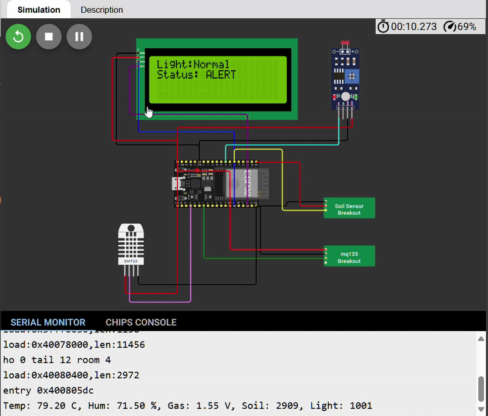

# ♻️ Khadyakosh – Compost Health Monitoring System

**Khadyakosh** is an IoT + Web platform that helps individuals and communities monitor compost conditions in real-time, ensuring optimal decomposition and reducing environmental harm.

## This project is submitted under the _Sustainable Tech & Climate Innovation_ category at CodeForBharat Hackathon.

## 📦 Tech Stack

| Component          | Technology Used                 |
| ------------------ | ------------------------------- |
| **Frontend**       | Next.js (React Framework)       |
| **Auth**           | Firebase Authentication         |
| **Database**       | Firebase Realtime Database      |
| **IoT Simulation** | Wokwi (virtual ESP32 + sensors) |
| **IoT**            | ESP32 + MQ135 + DHT22           |

---

## 🚀 Features

- Realtime sensor data display (Temperature, Humidity, Gas PPM)
- Firebase-authenticated dashboards for each user
- Compost health status (Healthy / Alert / Warning)
- IoT-ready architecture with ESP32 and DHT22 + MQ135 sensors
- Easy-to-deploy backend-free Firebase integration

---

<h2>🧪 Sample of IOT</h2>

<h3>🌱 Traditional Composting (DHT22 + MQ135)</h3>

  

  <a href="https://wokwi.com/projects/436373210560617473">🔗 Live Traditional Wokwi Simulation</a>

---

<h3>🪱 Vermicomposting (DHT22 + MQ135 + Soil Moisture sensor + LDR)</h3>

  

  <a href="https://wokwi.com/projects/436456472645397505">🔗 Live Vermicompost Wokwi Simulation</a>

---

 The current simulations displays gas sensor output in volts, representing raw analog readings. PPM conversion requires calibration with real sensors and is not shown here. 

---

## 📡 IoT Integration

- We use an **ESP32 microcontroller** connected to DHT22 and MQ135 sensors (traditional) and soil + LDR sensors (vermi).
- The device pushes data to **Firebase Realtime Database** under each user's node.
- We’ve simulated this setup on [**Wokwi**](https://wokwi.com) for testing without real hardware.

### 🔬 IoT Simulation (Wokwi)

You can explore the simulation in the `/wokwi` folder.  
Open the `diagram.json` file directly in [Wokwi](https://wokwi.com) or run it using the [Wokwi CLI](https://docs.wokwi.com/guides/wokwi-cli).  
Alternatively, try the live simulations using the links above.

### ⚠️ Note on Wokwi Simulations

Wokwi simulations rely on public servers and may occasionally lag or fail, especially on the **free plan**.

If you face issues:

- 🔄 Click the **“Start Simulator”** button manually.
- 🔁 Refresh the page.
- 💻 Use Chrome for best compatibility.
- 🧪 Or run it locally using [Wokwi CLI](https://docs.wokwi.com/guides/wokwi-cli).
